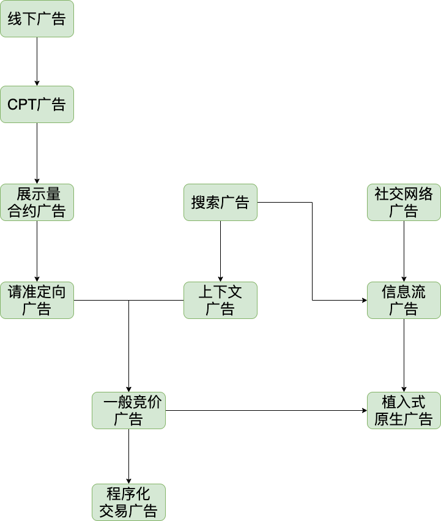

## 计算广告史

#### 广告历史背景&计算广告在广告史中的位置

#### 计算广告定义&分类

#### 计算广告的发展

既然产品本身没有利润，这些产品的开发者的利润从哪里来呢？其实，这类免费产品在传播信息的过程中，获得了3项可变现的核心资产，这就是流量、数据和影响力。

（1）流量。流量的价值是，有人使用你的产品，你便可以在产品本身的功能之外夹带一些付费内容（sponsored content），或者称为广告，这样就把流量变成了收入。

（2）数据。有人在使用你的产品的过程中留下了一些行为和属性，比如搜过某个关键词，浏览过某个商品，填写过自己的性别，这些都是数据。根据这些数据，你可以更好地了解该用户的属性、偏好等信息。基于这些信息，可以调整投放付费内容的策略以提高效率。

（3）影响力。影响力指的是你的产品或内容获得了高于普通水准的关注与信任。当然，你投放的付费内容也就同时获得了更好的关注效果，而这些对于提高转化率同样是至关重要的（参见2.1节）。因此，具备影响力的产品或内容在投放广告时可以获得品牌溢价。

计算广告这个课题在以Google AdWords为代表的竞价广告业务产生以后逐渐成形，并且在展示广告进入程序化交易阶段以后愈加成熟，而将其整理成一个新的研究方向，则要归功于时任Yahoo!广告首席科学家的Andrei Broder。他在斯坦福开设的“Computational Advertising”这门课，第一次全面而系统地介绍了在线广告中的计算挑战，以及工业界中的实用算

在线广告简史

在讨论广告技术之前，我们先看一下在线广告发展的历程。因为广告市场的概念、技术和术语繁多，所以如果不是对这些有基本的了解，就很难深入探讨具体的产品。

在20世纪末，那时的在线媒体（如AOL、Yahoo!等网站）刚刚产生不久。它们的流量规模很大，投资人当然希望这些媒体也能够给自己带来真金白银。要对这些线上流量进行变现，或者称为商业化，最直接的方法就是把网站页面当成杂志版面，在里面插入广告位。线下的广告代理公司也就把这些网站当成新的杂志，按既往思路和逻辑进行采买。我们称这种在互联网上展示横幅广告的产品形式为展示广告（display advertising），也称显示广告。我们称上述的展示广告售卖模式为合约广告（agreement-based advertising），即采用合同的方式约定某一广告位在某一时间段为特定广告主所独占，并且根据双方的要求，制订广告创意和投放策略。如图1-14中左半部分所示，例如，这样一个广告位一天的售卖价格是10 000元。显然，这样的采买模式并没有用到数字媒体可以对不同用户投放不同内容的个性化特征。

在了解计算广告之前，我们先讨论一下广告的一般目的。什么是广告？可以参考William F.Arens在《当代广告学》[4]中给出的定义：

广告是由已确定的出资人通过各种媒介进行的有关产品（商品、服务和观点）的，通常是有偿的、有组织的、综合的、劝服性的非人员的信息传播活动。

述广告这种商业活动的根本目的呢？我们仍然借用《当代广告学》中的见解：

广告的根本目的是广告主通过媒体达到低成本的用户接触。

这一定义中有两个关键点。首先，它指出了广告活动的两个主动参与方，即出资人（sponsor）和媒体（medium）。在数字广告复杂的市场结构中，可以用一般性的术语来描述它们：需求方（demand）和供给方（supply）。前者可以是广告主（advertiser）、代表广告主利益的代理商（agency）或其他技术形态的采买方；后者可以是媒体，也可以是其他技术形态的变现平台。另外，广告还有一个被动的参与方，即受众（audience）。请大家从现在开始，就牢牢建立起这样的概念：出资人、媒体和受众这三者的利益博弈关系是广告活动的主线，这一主线将贯穿于商业和产品形态的整个演化过程。另外，该定义还阐明了广告必须是有偿的、非人员的信息传播活动，这两点限制，前者使广告的目标变得明确，后者使这一目标可以用计算的方式来优化，这些都是计算广告产生的基础。

在传统媒体时代，供给方与需求方在市场地位上有相当的距离，不论是电视台、机场还是杂志，都与大多数广告主需要的转化行为之间有相当大的差距。因此，传统广告的目的主要是借助媒体的力量来快速接触大量用户，以达到宣传品牌形象，提升中长期购买率与利润空间的目的。我们称这种目的的广告为品牌广告（brand awareness）。当然，也有许多广告商希望能利用广告手段马上带来大量的购买或其他转化行为，我们称这种目的的广告为直接效果广告（direct response），有时简称为效果广告。

互联网环境中，广告的本质虽然没有变化，但是由于大量直接效果需求的产生，其表现形式越来越丰富和灵活。不论是与线下类似的横幅、搜索竞价排名，还是软文，甚至是表面上与广告并不相干的游戏联运，其本质都是付费的信息推广，从产品的角度来看都可以归在广告的范畴下。因此，对于互联网广告，我们有如下认识：

一切付费的信息、产品或服务的传播渠道，都是广告。

1）横幅广告（banner ad）。这是展示广告中最传统的形式。它是嵌入在页面中的图片，往往需要占据固定大小的版面。目前，横幅广告大多数也都不再是静止的图片，而是由Flash或HTML5等方式实现的动态素材。图1-2给出了横幅广告的一个示例。

2）文字链广告（textual ad）。这种广告的素材形式是一段链接到广告主落地页的文字，是搜索广告的主流形式，在展示广告中也被广泛采用。文字链广告有时像横幅广告那样占据固定版面，有时则穿插在大量内容链接条目中。图1-3给出了文字链广告的一个示例。

（3）富媒体广告（rich media ad）。这类广告利用视觉冲击力较强的表现形式，向用户侵入式地投送广告素材。富媒体广告常见的形式有弹窗、对联、全屏等。它比较适合在高质量的媒体做品牌性质较强的广告投放，但是对用户的使用体验往往影响也较大。一些门户网站的首页有时会为某个品牌广告主提供专门定制的、交互形式很复杂的富媒体广告，这样的广告不太采用按受众投放的逻辑，主要强调创意的冲击力和交互形式的特色。图1-4给出了一个富媒体广告中的弹窗广告示例。

（4）视频广告（video ad）。视频广告指的是广告的创意由静态素材变成了一段视频，其信息的传播量和冲击力都得以大大提高。可以说，视频化已经成为在线广告最重要的趋势之一。有关视频广告的效果评价，除了点击率等，还可以采用用户观看时长等更接近用户印象的指标。

视频内容播放之前的前插片广告。根据插入位置的不同，视频广告又可以分为前插片、后插片、暂停等类型。图1-5给出了视频广告的示例。视频广告由于载体的独特性质，其效果和广告创意会比较类似于线下的电视广告。这种广告一般采用短视频的形式，创意的表现力要远远强于普通的展示广告，因此价格往往也比较高。

· 在信息流中插入的视频广告。在Wi-Fi场景下往往自动播放，其效果远优于普通的信息流展示广告。

· 手机游戏中的激励视频广告。它主要是利用游戏中的积分奖励，刺激用户主动观看视频广告，这种广告往往观看率较高，广告效果也较好。

5）交互式广告（playable ad）。视频广告承载了更多的创意信息，因此会带来较好的推广效果。于是，在移动场景下，业界开始探索让用户直接在创意上完成交互，体验被推广产品的交互式方案。

6）社交广告（social ad）。社交网络的兴起给广告传播的渠道和能力都赋予了新的空间。在社交网络中嵌入的广告，可以统称为社交广告。社交广告中最典型的形式是插入在信息流中的广告，这种方式最早见于Twitter的“Promoted Tweets”产品。它力求在用户的交互过程中尽可能自然地插入广告，被归于原生广告的范畴中。“社交广告”与“社交网络中的广告”是两个不同的概念，例如，在社交网络页面上竞价售卖的文字链或横幅广告，其本质与普通网站上的展示广告并无太大区别。社交广告希望达到的效果是通过用户的扩散式传播获得更大的影响力，从这个意义上讲，在信息流的交互中挖掘价值前景光明。图1-7给出了社交网络信息流广告的一个示例。

7) 移动广告（mobile ad）。移动互联网在近几年爆发式成长，并且大有取代桌面互联网之势。严格来说，移动广告与桌面广告没有本质的区别，只是由于移动原生应用的大量普及，广告也由Web页面搬进了应用里。于是，也产生了在应用中插入广告的SDK和相应的广告产品。移动广告目前典型的形式有横幅、开屏、插屏、积分墙或推荐墙等。图1-8给出了移动广告形式的一些示例，我们将在第8章中具体讨论与移动广告和原生广告相关的产品问题。
8) （8）邮件营销广告（Email Direct Marketing，EDM）。这是通过电子邮件向用户推广信息的一种营销手段。与上面各种广告形式都不同，EDM是一种主动营销方式，可以随时向合适的用户发送信息。不过也正因为如此，EDM非常容易变成垃圾邮件的主要来源。对EDM的运营者而言，精准地把握用户兴趣，非常有节制地向用户提供相关信息非常关键。比起展示广告，EDM中受众定向的利用更加直接，也更为重要。图1-9给出了邮件营销广告的一些示例。另外，通过短信、iMessage等方式投放的广告，与邮件营销广告也非常相似。
9) 9）激励广告（incentive ad）。数字广告区别于传统广告的重要特点是可以产生直接转化，因此很容易想到的一个策略，就是直接激励用户产生转化以提高效果，这类广告称为激励广告。激励广告的典型代表之一是移动上常用的积分墙模式，如图1-10所示。
10) 10）团购。团购本质上是一种按照效果付费的泛广告产品，其本质也是一种激励性广告。团购推广的主要广告主是一些本地化的店铺，主要目的是为了获得新客。如图1-11所示，对团购平台来说，团购商品的排序与广告是一样的问题。传统的团购销售很少采用竞价的方式，而多是预先约定价格，不过目前各团购网站也在采用竞价的方式直接售卖。另外，团购的广告库中是付费信息而非创意，这有利于发展原生广告的推广方式，具体讲解参见第8章。
11) 11）游戏联运。游戏联运是根据用户的最终游戏内消费在推广渠道和游戏开发商之间分成的商业产品，这仍然是一种按效果付费的泛广告产品。在页游和手游的推广中，联运是一种非常常见的发行模式，读者在各种产品中看到的图1-12所示的游戏下载专区，其背后的商业模式往往都是联运。实际上，在中国的各大Android应用市场中，游戏联运的收入远远超过其他类型广告的收入。不同的联运渠道分成比例可能相差很大，在Apple Store这样典型的国外市场中，渠道的分成比例一般为30%，但是在中国，有些强势的联运渠道分成比例甚至可以达到90%以上。游戏联运完全可以按照广告产品思路来设计和运营。
12) （12）固定位导航。这主要包括网址导航站的位置入口（如图1-13所示）、应用分发平台的推荐位置等付费推广位置。一般来说，这种产品的销售都采用按时间付费的模式，而不是动态的竞价模式。这是因为广告主除了引流以外，往往更加关注这些入口位置的橱窗效应。这种广告的销售和运营模式与按天购买的合约广告相同。

广告系统中有一个重要的计算问题，即保证满足各合约目标量的要求的同时，尽可能为广告主分配到效果更好的流量。这个问题有两个难点：一是如何有效地将流量分配到各个合约互相交叉的人群覆盖上；二是要在在线的环境下实时地完成每一次展示决策。这就是在线分配（online allocation）问题。如果将各合约的量看作约束条件，将广告效果看作目标函数，则可以利用带约束优化（constrained optimization）的数学框架来解决。为了得到在线环境下切实可行的方案，学术界和工业界的同仁进行了大量理论和工程方面的研究，有一些高效且简便的方案已经为各媒体实际采用。

展示广告领域定向投放的最初动机，是媒体为了拆分流量以获得更高的营收。但是如果提供非常精细的定向，反而会造成售卖率的下降，因此，最初的定向标签往往是人口属性等粒度较粗的标签。不过，精细受众定向显然更符合需求方的口味和利益——不要忘了，广告市场的钱全部是来自需求方的，他们的利益被满足得越好，市场的规模就会越大。因此，受众定向产生以后，有两方面的发展趋势：一是定向标签变得越来越精准，例如具体某件商品的购物兴趣；二是广告主的数量不断膨胀。在这些趋势下，按照合约方式售卖广告遇到了越来越多的麻烦：首先，很难对这些细粒度标签组合的流量做准确预估；其次，当一次展示同时满足多个合约的时候，仅按照在线分配策略决策，有可能浪费了部分本可以卖得更贵的流量。既然量的约束带来了这些麻烦，有没有可能抛弃它呢？这样的思路催生了计算广告历史上革命性的产品模式——竞价广告（auction-based advertising）。在竞价模式下，供给方只向广告主保证质即单位流量的成本，但不再给出量的保证。对于每一次展示，则按照收益最高这样的简单原则来决策。

上面是从展示广告的发展看竞价产生的原因，但竞价广告产生的最初场景，是在互联网广告最主要的金矿——搜索广告（search ad）中。在以Google为代表的搜索引擎技术成熟以后，迅速成为互联网新的入口点。与门户网站不同，搜索引擎从一开始就没有被当作媒体来看待，因此搜索流量的变现也采用了付费搜索（paid search或sponsored search）的模式。从广告的视角来看，付费搜索显然也是一种定向广告，即根据用户即时兴趣定向投送的广告，而即时兴趣的标签就是关键词。搜索广告从一开始就直接达到了非常精准的程度，也就很自然地采用了竞价的售卖方式。

除了变现搜索流量本身，搜索引擎也开始考虑将关键词竞价的方式推广到其他媒体上：如果将用户的搜索词换成正在页面中的关键词，可以将此产品从搜索结果页照搬到媒体页面上，这就产生了上下文广告（contextual advertising）。

从宏观市场上看，竞价广告与合约广告有很大的不同。没有了合约的保证，大量的广告主处在一个多方博弈的环境中。与直觉不同的是，在如何向广告主收取每次竞价费用这一点上，并不是按照微观上最优的方案实施就可以达到整个市场最大的收益。关于定价机制的深入研究，产生了广义第二高价（Generalized Second Price，GSP）这一竞价重要的理论。

基于竞价和精准人群定向这两个核心功能，产生了广告网络（AD Network，ADN）这种新的产品形式。它批量地运营媒体的广告位，按照人群或上下文标签售卖给需求方，并用竞价的方式分配流量。广告网络的结算以按点击付费（Cost per Click，CPC）的方式为主，这里有数据和业务等方面的原因，我们将在2.3.2节中具体探讨。这种产品的千次展示收益（Revenue per Mille，RPM）一般来说达不到合约广告的水平，但它使大量媒体的剩余流量（remnant inventory），即没有能力通过合约售卖的流量，有了可行的变现手段：这些媒体可以直接把自己的库存（inventory）托管给ADN，借助ADN的销售和代理团队让自己的流量变现。

搜索广告、广告网络只有出价接口，是否意味着广告主不再需要量的保证呢？实践中，往往还会由需求方产品来保量。竞价广告产生以后，流量采买形式发生了变化：一是更多地面向受众而非广告位进行采买；二是越来越需要技术手段保证广告主量的要求，并在此基础上优化效果。这又是一个与在线分配类似的带约束优化问题。但是实际上，这个问题有很大不同：因为只能在供给方定义好的标签组合上指定出价，而不能控制每一次展示的出价，市场看起来更像一个黑盒子，所以需求方只能靠选择合适的标签组合，以及阶段性调整出价来间接控制效果。这种面向多个ADN或媒体按人群一站式采买广告，并进行量和质优化的需求方产品，称为交易终端（Trading Desk，TD）。

广告网络的竞价过程是内部进行的，这无法满足广告主定制化的人群选择和优化要求。设想下面的两种情形。

（1）某电商网站准备通

在大多数广告产品中，可以通过计算优化的主要是收入部分，而千次展示期望收入（expected Cost per Mille,eCPM）正是计算广告中最为核心的量化指标之一。与广告的信息传达过程相关，eCPM又可以分解为点击率和点击价值的乘积，这两个指标是各种广告产品在计算过程中经常遇到的，也是产品运营需要深入理解和重点关注的。

从过去20年的发展来看，互联网广告发展的路线图如下图所示

#### 计算广告国外公司发展 

##### 谷歌

**October 23, 2000**: Google AdWords launches with 350 advertisers. This was actually Google's second advertising program, after premium sponsorship was launched in August 2020

**February 2002**: AdWords adopts a cost-per-click auction model, where advertisers bid on how much they will pay per ad click

**May 2003**: Google AdSense launches, enabling users to display targeted AdWords ads on their own website

**June 2005**: Site Targeting is introduced, allowing advertisers to choose specific sites to appear on, rather than just targeting specific keywords 

**August 2005**: the platform updates minimum bids to include Quality Score

**November 2005**: Google Analytics launches, allowing advertisers to thoroughly track. all of their online campaigns

**January 2006**: Google AdWords launches a closed beta version of AdWords Editor - a downloadable account management application that allows users to quickly and easily make changes to their account

**March 2006**: Google AdWords offers demographic site selection for advertisers targeting users in the United States

**March 2006**: Google AdWords begins to offer local business ads that enable advertisers to promote their business location on the Google local map, complete with phone number and/or image

**April 2007**: Google acquires DoubleClick that provides advertisers an easy and efficient way to manage both search and display ads in one place while offering superior tools for targeting, serving and analyzing online ads

**Januray 2008**: Demographic bidding beta test on the content network, allowing advertisers to amend bids or even stop ads showing for demographic profiles on certain websites

**March 2009**: Interest-based advertising is announced on the Google content network, which allows advertisers to target users based on their interests

**November 2009**: Ad Sitelinks are born, which allow advertisers to provide additional links to content deep within their sites. these links can display up to four additional Destination URLs on search-based text ads 

**March 2010**: AdWords remarketing rolls out to reach users based on their past interactions with your website

**Januray 2011**: AdWords now allows negative keywords to be kept in lists and applied across multiple campaigns

**March 2011**: New targeting options are released based on a user's physical location or their location of interest

**October 2011**: Dynamic Search Ads are released that combines the power of Google's web-crawling technology and knowledge of a website's inventory to automatically generate an ad and destination URL based on the query and the content on the web page

**February 2013**: Enhanced Campaigns introduced, helping advertisers reach people with the right ads (based on location, time of day, device type, etc.) and across all devices without having to set up and manage multiple campaigns

**September 2015**: Customer Audience is announced that requires user-uploaded data to target prospects

**Februray 2016**: AdWords removes ads from right sidebar in search results pages (with the exception of PLAs), moving closer to a 'mobile-first' approach. Now four ads will appear above the natural results, and three below

**May 2016**: AdWords changes the color of the ad indicator from yellow to green, making ads and organic results look nearly identical

**May 2016**: Text Ad limits increase fro the first time in history., which will now contain two headlines (30 characters each), one description line(80 characters), and an automatically generated domain in the display URL

**December 2016**: AdWords allows marketers to apply audience lists at the campaign level, making it easier for marketers to manage audience lists at scale and change bid adjustments

**April 2017**: Smart Display Campaigns are introduced, enabling advertisers to reach more customers on Google Display Network easier

**May 2017**: "Similar Audiences" for Search and Shopping and "Customer Match" for Shopping are now available

**August 2017**: AdWords begin rolling out the "Landing pages" page to help advertisers see how their landing pages are performing - which URLs are mobile-friendly, generating the most sales, and which ones may require attention

**June 2018**: Google AdWords change its name to Google Ads

[目前google广告支持的投放定向能力](https://support.google.com/google-ads/answer/2404191)

##### facebook

**2004:** Facebook launches as TheFacebook.com in February 2004. Student Mark Zuckerberg remarks to the [Harvard Crimson school newspaper](http://www.thecrimson.com/article/2004/3/1/facebook-expands-beyond-harvard-harvard-students/) that it might be nice to get some advertising to offset the costs of the servers

**2004:** Facebook launches its first ad revenue project, called Flyers, which were ads placed on Facebook's homepage. This offered local businesses the opportunity to send ads to a particular college campus. This evolves into an auction model called Flyers Pro.

**2005:** Facebook starts to offer sponsorship deals to big brands for its Groups section. Apple gets involved, sponsoring a group on Facebook, and agrees to pay Facebook $1 per member per month. The group's membership explodes in popularity, earning Facebook over $100,000 in its first few months.

**2006:** Microsoft signs a three-year agreement with Facebook to be the exclusive provider and seller of sponsored links and banner ads. In August, Facebook launches its video advertising platform.

**2007:** Facebook launches its Facebook Ads platform, part of which includes [Beacon](https://www.pcworld.com/article/140182/article.html) and Facebook Marketplace. Beacon was found to track online actions by Facebook users on more than 40 sites, even after they left the network. Facebook Marketplace is still with us today.

**2008:** Facebook launches "Pages," hoping to actively court page owners to do paid advertising down the line. In addition, the network optimizes its service for mobile phones.

**2009:** Facebook introduces various language ad options and geographical targeted ads options.

**2010:** Facebook offers its site as a mobile app. By 2017, Facebook has over 1.8 billion active mobile users.

**2011:** Facebook offers advertisers a desktop ad program called Sponsored Stories. Advertisers' content appears in users' feeds and looks like posts from friends. Unfortunately, users felt misled by the program. Just three years later, the company drops it from its advertising options, after [users cite privacy concerns](https://www.forbes.com/sites/drewhendricks/2014/01/16/facebook-to-drop-sponsored-stories-what-does-this-mean-for-advertisers/#e92e492a81f2).

**2012:** Facebook offers advertisers the Social Graph, which brings together data from connections, likes, and follows by users. The data are used by Facebook with advertisers. Also introduced is Facebook Exchange, a real-time bidding vehicle for advertising.

**2013:** Facebook buys Atlas Solutions from Microsoft for $100 million to escalate its ad-serving capabilities. Retargeted ads start showing up in users' feeds, displaying products and services users searched for outside of the Facebook universe.

**2014:** Facebook's ad revenue expected to reach $7.7 billion for the year.

**2015:** Mid-year results show [Facebook's mobile ad revenue in 2015's second quarter](http://fortune.com/2015/07/29/facebook-mobile-ad-revenue/) reach nearly $3 billion, 75 percent of its total ad revenue.

**2016:** Facebook's [international ad revenue in 2016](https://marketingland.com/2016-facebook-advertising-preview-4-trends-act-150552) grows at massively high rates as the rest of the world catches up with Facebook's growth in America.

**2017:** Facebook unknowingly runs fake ads during the 2016 U.S. presidential election. To help stop any future false ads, Facebook says it will [show users](https://newsroom.fb.com/news/2017/10/update-on-our-advertising-transparency-and-authenticity-efforts/) which posts on pages are ads.

**2018:** Facebook continues to expand ad formats, offering 11 different types of [advertising options](https://www.facebook.com/business/ads-guide).

##### youtube

**2005**: Founding (2005)

**2006**: Growth (2006)

**2006**: Purchase by Google (2006)

**2006**: Person of the year (2006)

**2007-2013**: Continued growth and functionality (2007–2013)

> It is estimated that in 2007, YouTube consumed as much [bandwidth](https://en.wikipedia.org/wiki/Bandwidth_(computing)) as the entire Internet in 2000.[[36\]](https://en.wikipedia.org/wiki/History_of_YouTube#cite_note-36)
>
> YouTube's early website layout featured a pane of currently watched videos, as well as video listings with detailed information such as full (2006) and later expandable (2007) descriptions, as well as profile pictures (2006), ratings, comment counts, and tags.[[37\]](https://en.wikipedia.org/wiki/History_of_YouTube#cite_note-37)[[38\]](https://en.wikipedia.org/wiki/History_of_YouTube#cite_note-38) Channels' pages were equipped with standalone view counters, bulletin boards, and were awarded badges for various rank-based achievements, such as "*#15 - Most Subscribed (This Month)*", "*#89 - Most Subscribed (All Time)*", and "*#15 - Most Viewed (This Week)*".[[39\]](https://en.wikipedia.org/wiki/History_of_YouTube#cite_note-200704channel-39)
>
> In March 2007, YouTube launched the [YouTube Awards](https://en.wikipedia.org/wiki/YouTube_Awards), an annual competition in which users voted on the best user-generated videos of the year.[[40\]](https://en.wikipedia.org/wiki/History_of_YouTube#cite_note-ap-40) The awards were presented twice, in 2007 and 2008. Video contests with prizes existed as early as December 2005, possibly earlier.[[41\]](https://en.wikipedia.org/wiki/History_of_YouTube#cite_note-41)[[42\]](https://en.wikipedia.org/wiki/History_of_YouTube#cite_note-42)
>
> At "youtube.com/browse", there were various [web feeds](https://en.wikipedia.org/wiki/Web_feed), including a list of the videos most recently videos to the site, suggesting an upload rate of approximately two videos per minute as of April 2007.[[43\]](https://en.wikipedia.org/wiki/History_of_YouTube#cite_note-43) Other feeds included the most viewed, highest rated, most discussed, most "favourited", most [backlinked](https://en.wikipedia.org/wiki/Backlink), staff picks, videos with most video responses, and "Watch on mobile". Some feeds could be filtered by categories including but not limited to "Autos & Vehicles", "Music", "News & Politics", "People & Blogs", "Travel & Places", and feeds except "Most recent" (where inapplicable) could be filtered by time range ("Today", "This week", "This month", "All time"). An uncaptioned [Verizon Wireless](https://en.wikipedia.org/wiki/Verizon_Wireless) logo resided on the "Watch on mobile" feed, suggesting a partnership.[[44\]](https://en.wikipedia.org/wiki/History_of_YouTube#cite_note-44)
>
> In June 2007, YouTube launched a [mobile web](https://en.wikipedia.org/wiki/Mobile_web) front end, where videos are served through [RTSP](https://en.wikipedia.org/wiki/RTSP).[[45\]](https://en.wikipedia.org/wiki/History_of_YouTube#cite_note-45)
>
> In July 2007, YouTube partnered with [Verizon Wireless](https://en.wikipedia.org/wiki/Verizon_Wireless) to enable [mobile phone](https://en.wikipedia.org/wiki/Mobile_phone) users to submit videos through [Multimedia Messaging Service](https://en.wikipedia.org/wiki/Multimedia_Messaging_Service) (MMS).[[46\]](https://en.wikipedia.org/wiki/History_of_YouTube#cite_note-46)
>
> On July 23, 2007, and November 28, 2007, [CNN and YouTube produced televised presidential debates](https://en.wikipedia.org/wiki/CNN-YouTube_presidential_debates) in which Democratic and Republican US presidential hopefuls fielded questions submitted through YouTube.[[47\]](https://en.wikipedia.org/wiki/History_of_YouTube#cite_note-CNN's_YouTube_debate_draws_impressive_ratings-47)[[48\]](https://en.wikipedia.org/wiki/History_of_YouTube#cite_note-48)
>
> In December 2007, YouTube launched the Partner Program, which allows channels that meet certain metrics (currently 1000 subscribers and 4000 public watch hours in the past year)[[49\]](https://en.wikipedia.org/wiki/History_of_YouTube#cite_note-49) to run ads on their videos and earn money doing so.[[28\]](https://en.wikipedia.org/wiki/History_of_YouTube#cite_note-Jackson-28)
>
> Around 2008, "Warp Player" was tested out. It was an experimental interactive interface for browsing videos, where links to videos appeared as thumbnails, visualized in a floating and navigable net.[[50\]](https://en.wikipedia.org/wiki/History_of_YouTube#cite_note-50)
>
> In June 2008, video annotations were introduced. Users were able to add text boxes and speech bubbles at any desired location and custom sizes in various colours, and optionally with a link and short pausing, allowing for interactive videos. In February 2009, the feature was extended to allow for collaboration, meaning uploaders could invite others to edit their video's annotations.[[51\]](https://en.wikipedia.org/wiki/History_of_YouTube#cite_note-51)[[52\]](https://en.wikipedia.org/wiki/History_of_YouTube#cite_note-52)[[53\]](https://en.wikipedia.org/wiki/History_of_YouTube#cite_note-53)
>
> Since October 2008, [deep linking](https://en.wikipedia.org/wiki/Deep_linking) to a playback position through a timestamped URL is possible.[[54\]](https://en.wikipedia.org/wiki/History_of_YouTube#cite_note-54)
>
> In November 2008, YouTube reached an agreement with [MGM](https://en.wikipedia.org/wiki/MGM), [Lions Gate Entertainment](https://en.wikipedia.org/wiki/Lions_Gate_Entertainment), and [CBS](https://en.wikipedia.org/wiki/CBS), allowing the companies to post full-length films and television episodes on the site, accompanied by advertisements in a section for US viewers called "Shows". The move was intended to create competition with websites such as [Hulu](https://en.wikipedia.org/wiki/Hulu), which features material from [NBC](https://en.wikipedia.org/wiki/NBC), [Fox](https://en.wikipedia.org/wiki/Fox_Broadcasting_Company), and [Disney](https://en.wikipedia.org/wiki/Walt_Disney_Studios_Motion_Pictures).[[55\]](https://en.wikipedia.org/wiki/History_of_YouTube#cite_note-55)[[56\]](https://en.wikipedia.org/wiki/History_of_YouTube#cite_note-56)
>
> YouTube was awarded a 2008 [Peabody Award](https://en.wikipedia.org/wiki/Peabody_Award) and cited as being "a 'Speakers' Corner' that both embodies and promotes democracy".[[57\]](https://en.wikipedia.org/wiki/History_of_YouTube#cite_note-57)[[58\]](https://en.wikipedia.org/wiki/History_of_YouTube#cite_note-58)
>
> In early 2009, YouTube registered the domain `www.youtube-nocookie.com` for videos embedded on United States federal government websites.[[59\]](https://en.wikipedia.org/wiki/History_of_YouTube#cite_note-59)[[60\]](https://en.wikipedia.org/wiki/History_of_YouTube#cite_note-60) In November of the same year, YouTube launched a version of "Shows" available to UK viewers, offering around 4,000 full-length shows from more than 60 partners.[[61\]](https://en.wikipedia.org/wiki/History_of_YouTube#cite_note-61)
>
> In April 2009, YouTube launched their earliest [HTML5](https://en.wikipedia.org/wiki/HTML5) video player experiments.[[62\]](https://en.wikipedia.org/wiki/History_of_YouTube#cite_note-62)
>
> Throughout 2009, the alphabetical sorting of YouTube's "AudioSwap" feature helped popularizing Alexander Perls' "[009 Sound System](https://en.wikipedia.org/wiki/009_Sound_System)" music project through frequent use in videos.[[63\]](https://en.wikipedia.org/wiki/History_of_YouTube#cite_note-63)[[64\]](https://en.wikipedia.org/wiki/History_of_YouTube#cite_note-64)
>
> .png)
>
> In June 2009, *YouTube XL* was launched. It was a front-end for viewing and browsing on [television sets](https://en.wikipedia.org/wiki/Television_set), and as such, for use on stationary game consoles with web browser, such as the [Nintendo Wii](https://en.wikipedia.org/wiki/Nintendo_Wii). Its appearance varied depending on device.[[65\]](https://en.wikipedia.org/wiki/History_of_YouTube#cite_note-65)[[66\]](https://en.wikipedia.org/wiki/History_of_YouTube#cite_note-66)
>
> In July 2009, developers of YouTube placed a site notice that warned about the impending deprecation of support for [Internet Explorer 6](https://en.wikipedia.org/wiki/Internet_Explorer_6), prompting its users to upgrade their browser. It is claimed that they represented 18% of site traffic at that time. Within months of the announcement, traffic from Internet Explorer 6 reduced to less than half, and traffic from other browsers surged accordingly.[[67\]](https://en.wikipedia.org/wiki/History_of_YouTube#cite_note-67)
>
> In late 2009, YouTube introduced automatic [captioning](https://en.wikipedia.org/wiki/Closed_caption) of videos through [speech recognition](https://en.wikipedia.org/wiki/Speech_recognition). Initially only available in English, it was expanded to six European languages in late 2012.[[68\]](https://en.wikipedia.org/wiki/History_of_YouTube#cite_note-68)[[69\]](https://en.wikipedia.org/wiki/History_of_YouTube#cite_note-69)
>
> *[Entertainment Weekly](https://en.wikipedia.org/wiki/Entertainment_Weekly)* placed YouTube on its end-of-the-decade "best-of" list In December 2009, describing it as: "Providing a safe home for piano-playing cats, celeb goof-ups, and overzealous lip-synchers since 2005."[[70\]](https://en.wikipedia.org/wiki/History_of_YouTube#cite_note-70)
>
> The transition from [ActionScript](https://en.wikipedia.org/wiki/ActionScript) version 2 to 3 was initiated in late 2009.[[71\]](https://en.wikipedia.org/wiki/History_of_YouTube#cite_note-71)
>
> In January 2010, the watch page layout was overhauled. Changes include a shortcut labelled with the number of channels' public videos added above the player to allow quickly accessing other videos of a channel without having to navigate to the channel page.[[72\]](https://en.wikipedia.org/wiki/History_of_YouTube#cite_note-72)
>
> In January 2010,[[73\]](https://en.wikipedia.org/wiki/History_of_YouTube#cite_note-73) YouTube introduced an online film rentals service which is currently available only to users in the US, Canada and the UK.[[74\]](https://en.wikipedia.org/wiki/History_of_YouTube#cite_note-74)[[75\]](https://en.wikipedia.org/wiki/History_of_YouTube#cite_note-75) The service offers over 6,000 films.[[76\]](https://en.wikipedia.org/wiki/History_of_YouTube#cite_note-76) In March 2010 YouTube began free streaming of certain content, including 60 cricket matches of the [Indian Premier League](https://en.wikipedia.org/wiki/Indian_Premier_League). According to YouTube, this was the first worldwide free online broadcast of a major sporting event.[[77\]](https://en.wikipedia.org/wiki/History_of_YouTube#cite_note-77)
>
> On March 31, 2010, YouTube launched a new design with the aim of simplifying the interface and increasing the time users spend on the site. Google product manager Shiva Rajaraman commented: "We really felt like we needed to step back and remove the clutter."[[78\]](https://en.wikipedia.org/wiki/History_of_YouTube#cite_note-78) In May 2010, it was reported that YouTube was serving more than two billion videos a day, which was "nearly double the prime-time audience of all three major US television networks combined".[[79\]](https://en.wikipedia.org/wiki/History_of_YouTube#cite_note-79) In May 2011, YouTube reported on the company blog that the site was receiving more than three billion views per day.[[80\]](https://en.wikipedia.org/wiki/History_of_YouTube#cite_note-48_hours-80) In January 2012, YouTube stated that the figure had increased to four billion videos streamed per day.[[81\]](https://en.wikipedia.org/wiki/History_of_YouTube#cite_note-60_hours-81)
>
> Until then, a five-point video rating system that used star icons was in use. Users were able to rate videos with one to five "stars", where more indicated greater preference. This rating system was replaced with a bidirectional one using positive "like" and negative "dislike" ratings, citing low numbers of users rating other than the most (5) or least (1) stars. Ratings of three or more "stars" were converted to "likes" and such below accordingly to "dislikes".[[82\]](https://en.wikipedia.org/wiki/History_of_YouTube#cite_note-82) This change was first announced in September 2009.[[83\]](https://en.wikipedia.org/wiki/History_of_YouTube#cite_note-83) As a reference, widely known sites that operate a five-level rating system as of 2021 are [IMDb](https://en.wikipedia.org/wiki/IMDb), [Amazon](https://en.wikipedia.org/wiki/Amazon), and the [Google Play Store](https://en.wikipedia.org/wiki/Google_Play_Store). Additionally, videos previously marked as "Favorite" have been moved to a playlist for each user.
>
> Later the same month, the control section of the [Flash](https://en.wikipedia.org/wiki/Adobe_Flash)-based video player was redesigned to feature a dedicated row for the seek bar, as is used since, as of 2021.[[84\]](https://en.wikipedia.org/wiki/History_of_YouTube#cite_note-84)
>
> According to May 2010 data published by [market research](https://en.wikipedia.org/wiki/Market_research) company [comScore](https://en.wikipedia.org/wiki/ComScore), YouTube was the dominant provider of online video in the United States, with a [market share](https://en.wikipedia.org/wiki/Market_share) of roughly 43 percent and more than 14 billion videos viewed during May.[[85\]](https://en.wikipedia.org/wiki/History_of_YouTube#cite_note-85)
>
> Around 2010, an [easter egg](https://en.wikipedia.org/wiki/Easter_egg_(media)) of the [Flash](https://en.wikipedia.org/wiki/Adobe_Flash)-based video player was discovered, where pressing the arrow key while the dotted loading animation is visible initiates a [Snake game](https://en.wikipedia.org/wiki/Snake_game) formed by the dots. The HTML5-based player, which initially had the same dotted loading animation, did not support it.[[86\]](https://en.wikipedia.org/wiki/History_of_YouTube#cite_note-86)[[87\]](https://en.wikipedia.org/wiki/History_of_YouTube#cite_note-87)
>
> In September 2010, a unique full-page interactive [TippEx](https://en.wikipedia.org/wiki/TippEx) advertising campaign was launched on YouTube, where the entire watch page was simulated in a [Flash](https://en.wikipedia.org/wiki/Adobe_Flash) viewport. A hunter who does not wish to shoot a bear grabs outside of the video's viewport to reach for a Tipp-Ex tape roller, and uses it to cover the word "shoots" in the video titled "A hunter shoots a bear". Users were able to enter words in the gap, which lead to different unlisted videos with a multitude of pre-recorded reactions.[[88\]](https://en.wikipedia.org/wiki/History_of_YouTube#cite_note-88)
>
> In October 2010, Hurley announced that he would be stepping down as the chief executive officer of YouTube to take an advisory role, with [Salar Kamangar](https://en.wikipedia.org/wiki/Salar_Kamangar) taking over as the head of the company.[[89\]](https://en.wikipedia.org/wiki/History_of_YouTube#cite_note-89)
>
> James Zern, a YouTube software engineer, revealed in April 2011 that 30 percent of videos accounted for 99 percent of views on the site.[[90\]](https://en.wikipedia.org/wiki/History_of_YouTube#cite_note-90)
>
> In June 2011, YouTube started experimenting with reaction buttons, allowing users to react to videos with a multitude of expressions, similar to [Facebook's 2016 reaction buttons](https://en.wikipedia.org/wiki/History_of_Facebook#Timeline), though YouTube removed reaction buttons soon after.[[91\]](https://en.wikipedia.org/wiki/History_of_YouTube#cite_note-91)[[92\]](https://en.wikipedia.org/wiki/History_of_YouTube#cite_note-92)
>
> During November 2011, the [Google+](https://en.wikipedia.org/wiki/Google%2B) social networking site was integrated directly with YouTube and the [Chrome](https://en.wikipedia.org/wiki/Google_Chrome) web browser, allowing YouTube videos to be viewed from within the Google+ interface.[[93\]](https://en.wikipedia.org/wiki/History_of_YouTube#cite_note-93) In December 2011, YouTube launched a new version of the site interface, with the video channels displayed in a central column on the home page, similar to the news feeds of [social networking](https://en.wikipedia.org/wiki/Social_networking) sites.[[94\]](https://en.wikipedia.org/wiki/History_of_YouTube#cite_note-94) It is based on a similar user interface was put to test as early as July 2011 under the code name "Cosmic Panda".[[95\]](https://en.wikipedia.org/wiki/History_of_YouTube#cite_note-95) At the same time, a new version of the YouTube logo was introduced with a darker shade of red, which was the first change in design since October 2006.[[96\]](https://en.wikipedia.org/wiki/History_of_YouTube#cite_note-96)
>
> In 2012, YouTube said that roughly 60 hours of new videos are uploaded to the site every minute, and that around three-quarters of the material comes from outside the U.S.[[80\]](https://en.wikipedia.org/wiki/History_of_YouTube#cite_note-48_hours-80)[[81\]](https://en.wikipedia.org/wiki/History_of_YouTube#cite_note-60_hours-81)[[97\]](https://en.wikipedia.org/wiki/History_of_YouTube#cite_note-97) The site has eight hundred million unique users a month.[[98\]](https://en.wikipedia.org/wiki/History_of_YouTube#cite_note-seabrook20120116-98)
>
> As of 2012, users were able to rate playlists, and videos' view counts and playlists' total duration were indicated on playlist pages.[[99\]](https://en.wikipedia.org/wiki/History_of_YouTube#cite_note-99)
>
> In March 2012, preview [tooltips](https://en.wikipedia.org/wiki/Tooltip) for the video player's seek bar were introduced on the desktop web front end, initially available on select videos and gradually rolled out. This feature allows the viewer to additionally preview portions of a video by [hovering above the seek bar with the mouse cursor](https://en.wikipedia.org/wiki/Mouseover), whereas only the time stamp was indicated before. Dragging the position handle of the video player additionally showed surrounding preview images in a film strip layout. For videos longer than 90 minutes, a magnified portion of the seek bar was additionally displayed since to facilitate fine seeking.[[100\]](https://en.wikipedia.org/wiki/History_of_YouTube#cite_note-100)
>
> From 2010 to 2012, [Alexa](https://en.wikipedia.org/wiki/Alexa_Internet) ranked YouTube as the third most visited website on the Internet after [Google](https://en.wikipedia.org/wiki/Google) and Facebook.[[101\]](https://en.wikipedia.org/wiki/History_of_YouTube#cite_note-101)
>
> In late 2011 and early 2012, YouTube launched over 100 ["premium" or "original"](https://en.wikipedia.org/wiki/YouTube_Original_Channel_Initiative) channels. It was reported the initiative cost $100 million.[[102\]](https://en.wikipedia.org/wiki/History_of_YouTube#cite_note-102) Two years later, in November 2013, it was documented that the landing page of the original channels became a 404 error page.[[103\]](https://en.wikipedia.org/wiki/History_of_YouTube#cite_note-103)[[104\]](https://en.wikipedia.org/wiki/History_of_YouTube#cite_note-104) Despite this, original channels such as [SourceFed](https://en.wikipedia.org/wiki/SourceFed) and [Crash Course](https://en.wikipedia.org/wiki/Crash_Course_(YouTube)) were able to become successful.[[105\]](https://en.wikipedia.org/wiki/History_of_YouTube#cite_note-105)[[106\]](https://en.wikipedia.org/wiki/History_of_YouTube#cite_note-106)
>
> An algorithm change was made in 2012 that replaced the view-based system for a watch time-based one that is credited for causing a surge in the popularity of [gaming channels](https://en.wikipedia.org/wiki/Let's_Play).[[107\]](https://en.wikipedia.org/wiki/History_of_YouTube#cite_note-107)
>
> In October 2012, for the first-time ever, YouTube offered a live stream of the [U.S. presidential debate](https://en.wikipedia.org/wiki/United_States_presidential_election_debates) and partnered with [ABC News](https://en.wikipedia.org/wiki/ABC_News) to do so.[[108\]](https://en.wikipedia.org/wiki/History_of_YouTube#cite_note-108) The peak in concurrent views on any live stream was reached on October 14, where over eight million watched a [sky dive](https://en.wikipedia.org/wiki/Sky_dive).[[109\]](https://en.wikipedia.org/wiki/History_of_YouTube#cite_note-109)
>
> On October 25, 2012, The YouTube slogan (Broadcast Yourself) was taken down due to the live stream of the [U.S. presidential debate](https://en.wikipedia.org/wiki/United_States_presidential_election_debates).
>
> YouTube relaunched its design and layout in early December 2012 to resemble the mobile and tablet app version of the site.[*[citation needed](https://en.wikipedia.org/wiki/Wikipedia:Citation_needed)*] Notable changes of the watch page are the relocation of title and the "Subscribe" button from above to below the video's viewport, the removal of the button that opened a section above the video viewport showing other videos of the same channel without needing to leave the watch page, and the removal of a button-sized [banner](https://en.wikipedia.org/wiki/Web_banner) located above the viewport, which could contain a custom image, popularly icons and text logos.[[110\]](https://en.wikipedia.org/wiki/History_of_YouTube#cite_note-110)
>
> On December 21, 2012, [Gangnam Style](https://en.wikipedia.org/wiki/Gangnam_Style) became the first YouTube video to surpass one billion views.[[111\]](https://en.wikipedia.org/wiki/History_of_YouTube#cite_note-111)
>
> As of early 2013, YouTube video recommendations contain both videos and channels.

**2013-Present**: Modern era, feature trimdown (2013-present)

> In early 2013, YouTube transitioned channels to the initially optional "One" channel layout, which added the ability to put playlists into shelves on the channel front page, but removed custom backgrounds. Formerly unified channel pages were separated into multiple sub pages such as "Videos", "Playlists", "Discussion" (channel comments), "Channels" (featured by user), and "About" (channel description, total video view count, join date, outlinks). Coarsely, this layout is still in operation as of 2021.[[113\]](https://en.wikipedia.org/wiki/History_of_YouTube#cite_note-113)
>
> In March 2013, the number of unique users visiting YouTube every month reached 1 billion.[[114\]](https://en.wikipedia.org/wiki/History_of_YouTube#cite_note-114) In the same year, YouTube continued to reach out to mainstream media, launching [YouTube Comedy Week](https://en.wikipedia.org/wiki/YouTube_Comedy_Week) and the [YouTube Music Awards](https://en.wikipedia.org/wiki/YouTube_Music_Awards).[[115\]](https://en.wikipedia.org/wiki/History_of_YouTube#cite_note-115)[[116\]](https://en.wikipedia.org/wiki/History_of_YouTube#cite_note-116) Both events were met with negative to mixed reception.[[117\]](https://en.wikipedia.org/wiki/History_of_YouTube#cite_note-117)[[118\]](https://en.wikipedia.org/wiki/History_of_YouTube#cite_note-118)[[119\]](https://en.wikipedia.org/wiki/History_of_YouTube#cite_note-119)[[120\]](https://en.wikipedia.org/wiki/History_of_YouTube#cite_note-120)
>
> Since early July 2013, the first page of videos' comment section is no longer included in the watch page's [HTML](https://en.wikipedia.org/wiki/HTML) source code, but instead loaded subsequently through [AJAX](https://en.wikipedia.org/wiki/Ajax_(programming)).[[121\]](https://en.wikipedia.org/wiki/History_of_YouTube#cite_note-121)
>
> In September 2013, the "video responses" feature introduced in 2006 was removed, citing a low [click-through rate](https://en.wikipedia.org/wiki/Click-through_rate). It allowed users to respond to videos through a new or existing video which appeared above the comment section.[[122\]](https://en.wikipedia.org/wiki/History_of_YouTube#cite_note-122)
>
> In the same month, YouTube's comment system merged with Google's [social network](https://en.wikipedia.org/wiki/Social_network) site "[Plus](https://en.wikipedia.org/wiki/Google_Plus)", since which a Google account is mandatory to be able to comment. Channels created prior as standalone YouTube accounts using its legacy registration form have been [grandfathered](https://en.wikipedia.org/wiki/Grandfather_clause) to a `/user/` URL.[[123\]](https://en.wikipedia.org/wiki/History_of_YouTube#cite_note-123)[[124\]](https://en.wikipedia.org/wiki/History_of_YouTube#cite_note-124)
>
> In November 2013, YouTube's own YouTube channel surpassed Felix Kjellberg's [PewDiePie](https://en.wikipedia.org/wiki/PewDiePie) channel to become the [most subscribed channel](https://en.wikipedia.org/wiki/List_of_the_most_subscribed_channels_on_YouTube) on the website. This was due to auto-suggesting new users to subscribe to the channel upon registration.[[125\]](https://en.wikipedia.org/wiki/History_of_YouTube#cite_note-125)
>
> In March 2015, YouTube introduced the ability to automatically publish videos at a scheduled time,[[126\]](https://en.wikipedia.org/wiki/History_of_YouTube#cite_note-126) as well as "info cards" and "end cards", which allow referring to videos and channels through a notification at the top right of the video at any playback time, and thumbnails shown in the last 20 seconds. In contrary to annotations, these work in the mobile app too, though are far less customizable.[[127\]](https://en.wikipedia.org/wiki/History_of_YouTube#cite_note-127)[[128\]](https://en.wikipedia.org/wiki/History_of_YouTube#cite_note-128)
>
> In December 2015 and January 2016, direct uploading through email and webcam recording respectively were removed. The former existed to support cell phones with limited web browsing capabilities.[[129\]](https://en.wikipedia.org/wiki/History_of_YouTube#cite_note-129)[[130\]](https://en.wikipedia.org/wiki/History_of_YouTube#cite_note-130)
>
> In mid-2016, the earliest experiments with a redesigned desktop web front end were conducted. It follows the "[material design](https://en.wikipedia.org/wiki/Material_design)" language and is based on the "Polymer" [web framework](https://en.wikipedia.org/wiki/Web_framework).[[131\]](https://en.wikipedia.org/wiki/History_of_YouTube#cite_note-material2016-131) A [light-on-dark color scheme](https://en.wikipedia.org/wiki/Light-on-dark_color_scheme), also known as "dark mode" or "dark theme", was first implemented in May 2017.[[132\]](https://en.wikipedia.org/wiki/History_of_YouTube#cite_note-132)
>
> Live streaming from the mobile app was rolled out in early 2017, initially only available to channeles with at least 10,000 subscribers.[[133\]](https://en.wikipedia.org/wiki/History_of_YouTube#cite_note-133)
>
> Annotations became uneditable on May 2nd, 2017. Since then, users were only able to remove all annotations from individual videos. Parts of the feature such as collaborative annotations and pause markings were already removed earlier.[[134\]](https://en.wikipedia.org/wiki/History_of_YouTube#cite_note-134)[[135\]](https://en.wikipedia.org/wiki/History_of_YouTube#cite_note-135)
>
> On August 29, 2017, YouTube changed both their logo and the design of their desktop website. The "Tube" part of the logo is no longer surrounded by the shape resembling a [CRT television](https://en.wikipedia.org/wiki/CRT_television). The shape moved left besides the "YouTube" word mark and has a white triangle resembling a [play button](https://en.wikipedia.org/wiki/Play_button). Their new "Polymer" web front based on that first tested in mid-2016 was made default for visitors.[[136\]](https://en.wikipedia.org/wiki/History_of_YouTube#cite_note-136)[[131\]](https://en.wikipedia.org/wiki/History_of_YouTube#cite_note-material2016-131)
>
> On April 3, 2018, [a shooting](https://en.wikipedia.org/wiki/YouTube_headquarters_shooting) took place at YouTube headquarters.[[137\]](https://en.wikipedia.org/wiki/History_of_YouTube#cite_note-137)
>
> In June 2018, a "Premiere" feature was added, where a video can be broadcast like a live stream after uploaded, and users can discuss in a live chat like they can in live streams. Before the video starts, an animated two-minute preroll with the soundtrack "Space Walk" by "Silent Partner" is played. A premiere can be set to start immediately after upload or at a scheduled time, though scheduled publications existed since March 2015.[[138\]](https://en.wikipedia.org/wiki/History_of_YouTube#cite_note-138)[[139\]](https://en.wikipedia.org/wiki/History_of_YouTube#cite_note-139)
>
> On July 9, 2018, the private messaging feature has been removed from "Creator Studio", purging existing messages.[[140\]](https://en.wikipedia.org/wiki/History_of_YouTube#cite_note-140) In the earlier years of YouTube, the feature existed separately as "Inbox".[[141\]](https://en.wikipedia.org/wiki/History_of_YouTube#cite_note-141)
>
> The removal of existing annotations on all videos was announced on November 27, 2018, and occurred as scheduled on January 15, 2019.[[142\]](https://en.wikipedia.org/wiki/History_of_YouTube#cite_note-142)[[143\]](https://en.wikipedia.org/wiki/History_of_YouTube#cite_note-143)[[144\]](https://en.wikipedia.org/wiki/History_of_YouTube#cite_note-144)
>
> On January 31, 2019, *AutoShare* was removed. The feature allowed users to opt to automatically broadcast actions such as liking videos, playlist additions, new uploads, and earlier added subscriptions to [Google Plus](https://en.wikipedia.org/wiki/Google_Plus) and [Twitter](https://en.wikipedia.org/wiki/Twitter), and the channel feed.[[145\]](https://en.wikipedia.org/wiki/History_of_YouTube#cite_note-145)[[146\]](https://en.wikipedia.org/wiki/History_of_YouTube#cite_note-146)
>
> On the same day, the dedicated section for video credits like "Starring", "Written by", and "Edited by" was removed from videos' description box, citing low usage. Addition of such was already disabled since November 27, 2018, the same day on which the definite annotation removal was announced.[[147\]](https://en.wikipedia.org/wiki/History_of_YouTube#cite_note-147)[[148\]](https://en.wikipedia.org/wiki/History_of_YouTube#cite_note-148)
>
> Since September 2019, channels' publicly displayed subscriber counts are abbreviated to the leading three digits, including those served through the [site API](https://en.wikipedia.org/wiki/Application_programming_interface). This means, for example, that a subscriber count of 102,847 is indicated as "102K" or "102.000". This change disabled third-party real-time subscriber count indicators such as that of [Social Blade](https://en.wikipedia.org/wiki/Social_Blade), and diminished the accuracy of historical log data. Exact counts remained accessible to channel operators through the "YouTube Studio" [web application](https://en.wikipedia.org/wiki/Web_application).[[149\]](https://en.wikipedia.org/wiki/History_of_YouTube#cite_note-149)[[150\]](https://en.wikipedia.org/wiki/History_of_YouTube#cite_note-150)
>
> Also in September 2019, the new "direct messaging" system was removed two years after introduction. This is a distinct system not to be confused with the legacy one removed in July 2018 after existing since YouTube's early years.[[151\]](https://en.wikipedia.org/wiki/History_of_YouTube#cite_note-151)[[152\]](https://en.wikipedia.org/wiki/History_of_YouTube#cite_note-152)
>
> In November 2019, YouTube has announced that the service would phase out the classic version of YouTube Studio to all YouTube creators by the spring of 2020.[[153\]](https://en.wikipedia.org/wiki/History_of_YouTube#cite_note-153) It was available and accessible to some YouTube creators by the end of March 2020.[[154\]](https://en.wikipedia.org/wiki/History_of_YouTube#cite_note-154)
>
> In that month, a watch queue feature was added, which resembles the intermittently removed "QuickList" feature that was originally introduced in 2006.[[155\]](https://en.wikipedia.org/wiki/History_of_YouTube#cite_note-155)[[156\]](https://en.wikipedia.org/wiki/History_of_YouTube#cite_note-QuickList-156)
>
> Since December 2019, users are no longer able to share the automatically generated playlist of positively rated videos.[[157\]](https://en.wikipedia.org/wiki/History_of_YouTube#cite_note-157)
>
> The ability to add polls with up to five options as video info cards was removed in May 2020.[[158\]](https://en.wikipedia.org/wiki/History_of_YouTube#cite_note-158)
>
> In June 2020, YouTube phased out the ability to use categories.
>
> In August 2020, automated [Email](https://en.wikipedia.org/wiki/Email) notifications of newly published videos by user-opted channels have been shut down, citing low numbers of users who open them. Only [push notifications](https://en.wikipedia.org/wiki/Push_notifications) (mobile) and internal web notifications (desktop) of new uploads remained.[[159\]](https://en.wikipedia.org/wiki/History_of_YouTube#cite_note-159)
>
> The "Community Captions" feature which allowed viewers to contribute captions for public display upon approval by the video uploader was removed in September 2020.[[160\]](https://en.wikipedia.org/wiki/History_of_YouTube#cite_note-160)[[161\]](https://en.wikipedia.org/wiki/History_of_YouTube#cite_note-161)
>
> In December 2020, comments on so-called "art tracks" which are automatically posted music tracks with album cover, frequently on "topic channels",[[162\]](https://en.wikipedia.org/wiki/History_of_YouTube#cite_note-162)[[163\]](https://en.wikipedia.org/wiki/History_of_YouTube#cite_note-163) have been permanently deactivated.[[164\]](https://en.wikipedia.org/wiki/History_of_YouTube#cite_note-164)
>
> After introducing the ability to visibly divide the video player's seek bar into chapters in May 2020 using time stamp lists in the video description, the platform started experimenting with automatic estimation of videos' chapters in November 2020 using [artificial intelligence](https://en.wikipedia.org/wiki/Artificial_intelligence) that detects in-video chapter titles.[[165\]](https://en.wikipedia.org/wiki/History_of_YouTube#cite_note-165)
>
> In July 2021, all unlisted videos prior to 2017[[a\]](https://en.wikipedia.org/wiki/History_of_YouTube#cite_note-166) were set to private, making them unplayable except on channels whose owners intervened by manually opting out.[[166\]](https://en.wikipedia.org/wiki/History_of_YouTube#cite_note-167)[[167\]](https://en.wikipedia.org/wiki/History_of_YouTube#cite_note-168)
>
> On August 24, 2021, YouTube sent a [cease and desist](https://en.wikipedia.org/wiki/Cease_and_desist) to the developers of Groovy, a [Discord](https://en.wikipedia.org/wiki/Discord_(software)) [bot](https://en.wikipedia.org/wiki/Internet_bot) which enabled audio from YouTube videos to be played in Discord voice chats, as the bot violated YouTube's Terms of Service.[[168\]](https://en.wikipedia.org/wiki/History_of_YouTube#cite_note-:3-169)[[169\]](https://en.wikipedia.org/wiki/History_of_YouTube#cite_note-170)[[170\]](https://en.wikipedia.org/wiki/History_of_YouTube#cite_note-171) A YouTube spokesperson stated, "We notified Groovy about violations of our Terms of Service, including modifying the service and using it for commercial purposes."[[168\]](https://en.wikipedia.org/wiki/History_of_YouTube#cite_note-:3-169) In a message announcing the bot's closure, the owner of Groovy, Nik Ammerlaan, said, "Groovy has been a huge part of my life over the past five years. It started because my friend’s bot sucked and I thought I could make a better one."[[168\]](https://en.wikipedia.org/wiki/History_of_YouTube#cite_note-:3-169)

#### 计算广告国内公司发展

##### 百度

##### 腾讯

##### 阿里

##### 长视频类公司：爱奇艺，腾讯视频，b站

##### 短视频类公司: 抖音，快手

#### 计算广告发展趋势

##### 带货

#### Reference

1. [facebook ads history](https://www.adtaxi.com/blog-roll/2018/03/08/ad-evolution-history-facebook)
2. [youtube 广告历史](https://en.wikipedia.org/wiki/History_of_YouTube)

